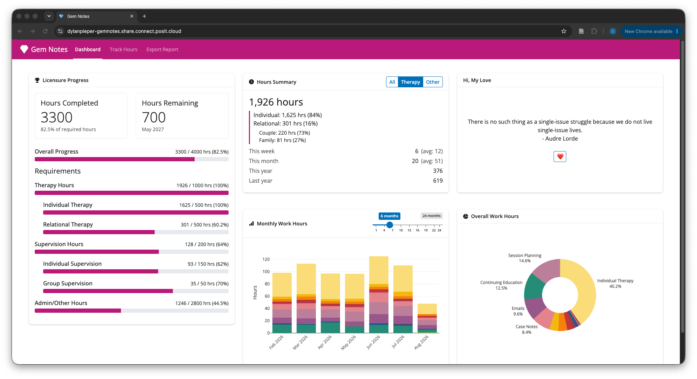
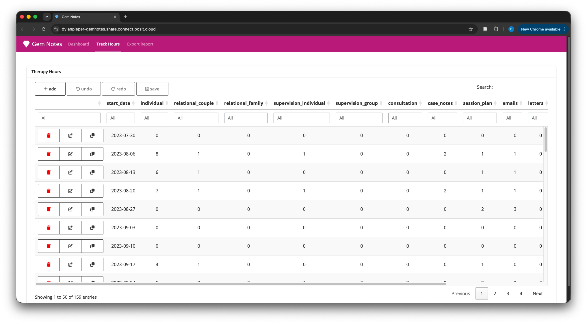
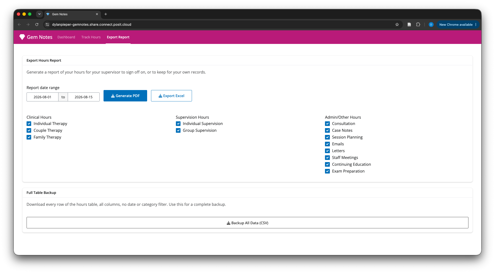

# gemnotes

A Shiny app for tracking clinical licensure hours—individual and relational therapy, supervision, consultation, and admin work—with configurable goals, hour entries/editing, data summaries, interactive visualizations, and report generation for supervisor sign-off.

## Story

I built this app for my wife, Julia ❤️, so she could track her hours toward licensure. I knew I had to help when I saw how long and arduous the process to become a "real" therapist was, including all of the documentation and approval that was required. This is the most important app I've ever built, because it's for the most important person to me. Building her tools is one of my love languages.

## Dear Therapists

This page might be confusing to you. If you want to use this app to track your own hours toward licensure, please email me at dylanpieper@gmail.com. I will help you set it up in exchange for a ☕.

## Look and Feel





## Requirements

- R (>= 4.3)
- [renv](https://rstudio.github.io/renv/) (`renv::restore()` installs the packages used)
- A Supabase (Postgres) project

## Setup

### 1. Supabase

Create an [account / project](https://supabase.com/), then run this in the SQL editor:

```sql
create table public.hours (
  start_date date not null,
  individual numeric(4, 1) not null default 0,
  relational_couple numeric(4, 1) not null default 0,
  relational_family numeric(4, 1) not null default 0,
  supervision_individual numeric(4, 1) not null default 0,
  supervision_group numeric(4, 1) not null default 0,
  consultation numeric(4, 1) not null default 0,
  case_notes numeric(4, 1) not null default 0,
  session_plan numeric(4, 1) not null default 0,
  emails numeric(4, 1) not null default 0,
  letters numeric(4, 1) not null default 0,
  staff_meetings numeric(4, 1) not null default 0,
  cont_ed numeric(4, 1) not null default 0,
  exam_prep numeric(4, 1) not null default 0,
  constraint weekly_therapy_hours_case_notes_check check ((case_notes >= (0)::numeric)),
  constraint weekly_therapy_hours_consultation_check check ((consultation >= (0)::numeric)),
  constraint weekly_therapy_hours_cont_ed_check check ((cont_ed >= (0)::numeric)),
  constraint weekly_therapy_hours_emails_check check ((emails >= (0)::numeric)),
  constraint weekly_therapy_hours_exam_prep_check check ((exam_prep >= (0)::numeric)),
  constraint weekly_therapy_hours_individual_check check ((individual >= (0)::numeric)),
  constraint weekly_therapy_hours_letters_check check ((letters >= (0)::numeric)),
  constraint weekly_therapy_hours_relational_couple_check check ((relational_couple >= (0)::numeric)),
  constraint weekly_therapy_hours_relational_family_check check ((relational_family >= (0)::numeric)),
  constraint weekly_therapy_hours_session_plan_check check ((session_plan >= (0)::numeric)),
  constraint weekly_therapy_hours_staff_meetings_check check ((staff_meetings >= (0)::numeric)),
  constraint weekly_therapy_hours_supervision_group_check check ((supervision_group >= (0)::numeric)),
  constraint weekly_therapy_hours_supervision_individual_check check ((supervision_individual >= (0)::numeric))
) TABLESPACE pg_default;
```

Posit Connect Cloud doesn't support direct connections (IPv6), so this app uses Supabase's session pooler instead. If you're using Connect, Grab your connection details from **Project Settings → Database → Connect**, under "Session pooler": host, port, database, and user. Put those four variables in `config.yml` (or `config_prod.yml`) as `db_host`, `db_port`, `db_name`, `db_user`. The password stays a secret in `GEM_SUPA_PASS`:

```yaml
db_host: "aws-0-us-east-2.pooler.supabase.com"
db_port: 5432
db_name: "postgres"
db_user: "postgres.<project-ref>"
```

**For security conscious developers:** the default user (`postgres.<project-ref>`) is a superuser over the whole project. Scoping a role to just `hours` means a leaked password only exposes one table instead of everything:

```sql
create role gemnotes_app with login password 'password';
grant usage on schema public to gemnotes_app;
grant select, insert, update, delete on public.hours to gemnotes_app;
```

Supavisor (the pooler) is flexible, so any login role works through the same host/port. In this case, set `db_user: "gemnotes_app.<project-ref>"` in your config.

### 2. Config

Settings and licensure goals live in `config.yml`. Copy it to `config_prod.yml` for deployment. The app prefers `config_prod.yml` when present, so it's gitignored and can hold real values and copyrighted quotes, if your heart desires:

```yaml
app_title: "Gem Notes"
table_name: "hours"
total_hours_goal: 4000
therapy_hours_goal: 1000
relational_hours_goal: 500
supervision_individual_goal: 150
supervision_group_goal: 50
admin_hours_goal: 2800
quotes:
  - "Your real quote here.<br>- Attribution"
```

The goal defaults above reflect Minnesota's LMFT licensure requirements—edit them to match your own state board. Set any `*_goal` to `0` to drop that category from the app entirely. `table_name` is the Postgres table holding hour entries.

### 3. Secrets

There are two environment variables that are never stored in a file:

| Variable | Purpose |
|---|---|
| `GEM_PASS` | Shared password gating the app's UI |
| `GEM_SUPA_PASS` | Password for the `db_user` set in `config.yml`, used by `RPostgres::Postgres()` |

For local development, add them to a `.Renviron` file at the project root (gitignored) and restart R. The `usethis::edit_r_environ("project")` function creates/opens the project-level `.Renviron` for you:

```
GEM_PASS=app-password
GEM_SUPA_PASS=db-password
```

## Running locally

```r
renv::restore()
shiny::runApp()
```

## Deploying to Posit Connect Cloud

1. Install [Posit Publisher](https://github.com/posit-dev/publisher) (included in Positron; or use VS Code extension or CLI).
2. Start a new deployment, targeting **Connect Cloud**. Publisher writes `.posit/publish/*.toml`; confirm/add `config_prod.yml` under project files.
3. Declare `GEM_PASS` and `GEM_SUPA_PASS` as secrets in that config, and set their values when prompted. Connect Cloud stores them encrypted and injects them as environment variables at runtime. If you are not prompted to set the values or miss it, let it error on deploy/publish, then set these variables on [https://connect.posit.cloud/](https://connect.posit.cloud/) under **Settings → Variables**. Hit republish, and enjoy using the app.


### Security

This app uses a single shared password (`GEM_PASS`) because only one or two people in the world will ever open it. It's not built to survive targeted attacks. Here's what that means in practice:

- **What's at stake.** The database contains dates and hour counts; that's it. A worst-case breach means someone sees or deletes therapy hour totals, which is annoying but not dangerous.

- **Use a strong password.** Automated scanners crawl public Connect Cloud URLs and try common passwords. Make `GEM_PASS` a random string of 16+ characters. There's no brute-force protection in the app, so a weak password is the single biggest risk.

- **Scope your database role.** The default Supabase user is a superuser. The `gemnotes_app` role in the setup section limits access to just the `hours` table, so a leaked `GEM_SUPA_PASS` can only affect one table.

- **Back up your data.** The "Export Report" tab includes a CSV dump of your data; download your data periodically and keep it somewhere safe. On the database side, Supabase offers point-in-time recovery on paid plans.